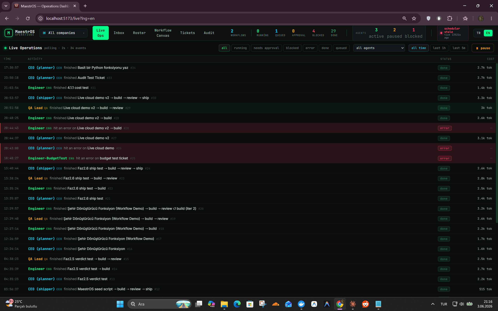
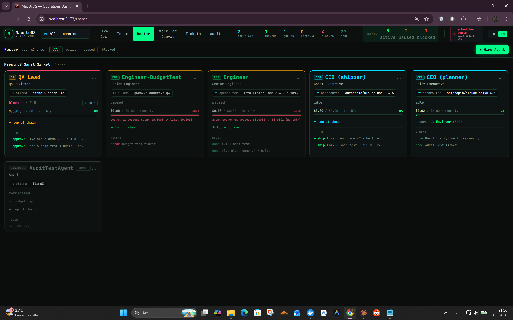
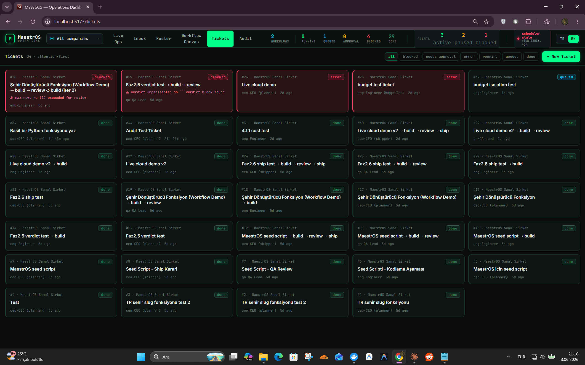
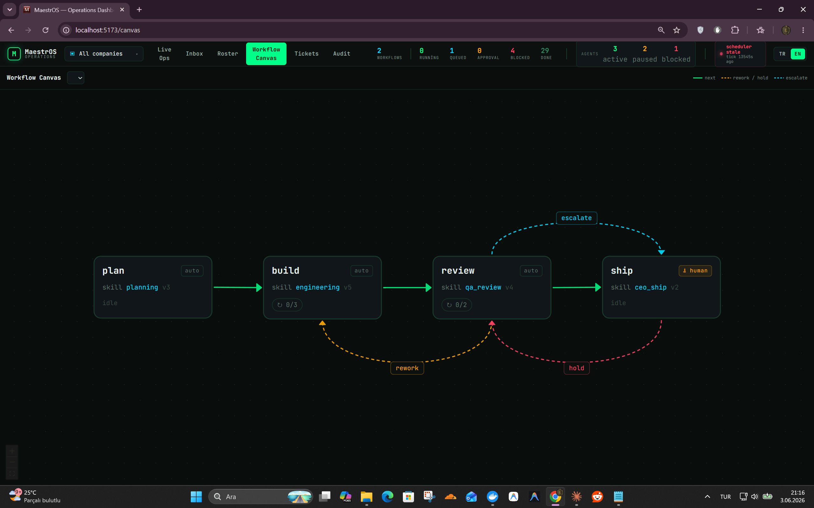

# 🎼 MaestrOS

> Rolleri olan AI ajanlarından oluşan lokal bir "yazılım şirketi" — iş, workflow fazlarında akar; her ajanın kendi modeli, bütçesi ve insan onay kapısı vardır.



| Roster | Tickets | Workflow Canvas |
|--------|---------|-----------------|
|  |  |  |

---

## MaestrOS Nedir?

MaestrOS, yapay zeka ajanlarından oluşan sanal bir şirketi yönetmek için geliştirilmiş bir **kontrol düzlemi**. Her ajan bir rol taşır (CEO, Planner, Engineer, QA…), bir Markdown skill dosyasıyla tanımlanır ve rolünden çıkmaz — Planner'dan kod yazmasını istersen spec yazar, başka bir şey yapmaz. İş, ticket-by-ticket olarak `plan → build → review → ship` zincirinde akar; QA rework isterse build'e döner, CEO nihayet onaylar. Her şey lokal çalışabilir: Ollama, Anthropic ve OpenRouter'ı aynı workflow içinde karıştırabilirsin. Bunu kişisel bir AI platform'a dönüştürmek için başlattım — YouTube otomasyonu, görsel üretim stüdyosu gibi farklı iş alanları için ayrı AI şirketleri ekleyeceğim.

---

## ✨ Concept

MaestrOS bir **otonom yazılım şirketi** modeller: Planner, Engineer, QA, CEO gibi uzmanlaşmış AI ajanlardan oluşan bir ekip, ticket alır, tanımlı bir **workflow** içinde çalışır ve birbirine el sunar; hassas adımlarda insan onay kapısı devreye girer.

Her ajan, bir **skill** (Markdown sistem prompt'u) ile tanımlanan bir **karakterdir** ve rolünde kalır: Planner'dan kod yazmasını iste, reddeder ve spec yazar. İş, fazlar halinde akar (`plan → build → review → ship`); verdict-aware yönlendirme, rework döngüleri, ajan ve şirket başına bütçe, değiştirilemez audit kaydı dahildir.

---

## 🏛️ Mimari — Üç Katman

MaestrOS, üç fikrin birleşiminden oluşur:

| Katman | Rol | İlham kaynağı |
|--------|-----|---------------|
| **1 · Control Plane** | Ajan başına model/config/bütçe/rol, atomik ticket checkout (`SKIP LOCKED`), heartbeat scheduler, governance kapıları, immutable audit log | Paperclip |
| **2 · Behavior Engine** | Markdown **skill**'ler sistem prompt'u olarak; sprint metodolojisi (`Think → Plan → Build → Review → Test → Ship → Reflect`) | gstack |
| **3 · Hiyerarşik Workflow** | YAML faz zinciri, verdict-aware dallanma, org chart (`reporting_to`), görsel canvas | ChatDev |

---

## ✨ Özellikler

- **Ajan başına provider & model** — aynı workflow içinde provider karıştır (Ollama · Anthropic · OpenRouter)
- **Otomatik duraklatan bütçe sistemi** — ajan *ve* şirket bazında limitler, dönem-duyarlı (daily / monthly / all-time); bütçesi dolan ajan otomatik duraklar, scheduler bütçesi dolmuş şirketi atlar
- **Atomik ticket claim** — `SKIP LOCKED` ile iki ajan aynı ticket'ı alamaz
- **Verdict-aware workflow** — fazlar, reviewer'ın kararına göre yönlenir (`approve / rework / escalate / ship / hold`); geriye dallanma ve rework döngü limiti desteklenir
- **Human-in-the-loop** — `human_approval` kapıları; tam bağlamla (parent zinciri, önceki verdict, bütçe etkisi) Approval Inbox
- **Değiştirilemez audit log** — operator / ajan / sistem, her eylem append-only kaydedilir
- **Operasyon dashboard'u** — altı view: Live Ops, Roster, Workflow Canvas, Tickets, Inbox, Audit
- **İki dilli arayüz** — Türkçe / İngilizce (chrome lokalize; teknik tanımlayıcılar İngilizce kalır)

---

## 🛠️ Teknoloji Stack'i

**Backend** — Python 3.12 · FastAPI · PostgreSQL · SQLAlchemy 2.0 (async) · Alembic · Pydantic  
**Frontend** — React 18 · Vite · TypeScript · Tailwind CSS · TanStack Query · React Flow · Recharts · i18next  
**Altyapı** — Docker · Docker Compose · Ollama (lokal modeller)

---

## ⚡ Başlarken

### Gereksinimler
- Docker & Docker Compose
- (Opsiyonel) [Ollama](https://ollama.com) — lokal modeller için
- (Opsiyonel) Anthropic / OpenRouter API anahtarları — cloud modeller için

### Çalıştır

```bash
git clone https://github.com/Simulate-X/MaestrOS.git
cd MaestrOS

# Ortam değişkenleri
cp .env.example .env                     # DB + opsiyonel API anahtarları
cp frontend/.env.example frontend/.env  # frontend API bağlantısı

docker compose up -d   # db · ollama · control-plane · scheduler · ui
```

- **Dashboard:** http://localhost:5173  
- **API docs (Swagger):** http://localhost:8080/docs

Yalnızca scheduler'ı yeniden başlatmak için:
```bash
docker compose restart scheduler
```

---

## 📁 Proje Yapısı

```
MaestrOS/
├── control-plane/          # FastAPI backend
│   ├── app/                # models, adapters, services, api
│   ├── alembic/            # veritabanı migration'ları
│   └── tests/              # 88 unit test
├── frontend/               # Vite + React + TS operasyon dashboard'u
├── skills/                 # Markdown skill'ler (ajan sistem prompt'ları)
├── workflows/              # YAML workflow tanımları
├── .env.example
├── docker-compose.yml
└── PROGRESS.md
```

---

## 🗺️ Yol Haritası

- [ ] **Çoklu şirket yapısı** — her iş alanı için ayrı AI ekibi
  - [ ] YouTube Otomasyonu: Trend Araştırmacı → Script Yazarı → SEO Uzmanı → Görsel Yönetmen
  - [ ] Görsel Üretim Stüdyosu: Brief Analisti → Prompt Mühendisi → Kalite Denetçi
- [ ] **Dinamik provider sistemi** — `GET /api/ollama/models` ile Ollama model listesi canlı çekilsin; hardcode `MODEL_CATALOG` kaldırılsın
- [ ] **Plugin-bazlı adapter yapısı** — yeni provider eklemek için core'a dokunmak gerekmeden (Paperclip yaklaşımı)
- [ ] `GET /agents` ve `GET /tickets`'a `company_id` filtresi
- [ ] Live Ops feed'i gerçek zamanlı (SSE veya daha sık polling)
- [ ] GitHub Actions CI/CD

---

## 🙏 Kaynaklar

MaestrOS'un üç katmanlı tasarımı üç projeden ilham aldı:  
**Paperclip** (control plane), **gstack** (skill-bazlı davranış), **ChatDev** (rol hiyerarşisi ve fazlı workflow'lar).

---

## 📄 Lisans

Bu proje MIT Lisansı ile lisanslanmıştır — detaylar için [LICENSE](LICENSE) dosyasına bak.